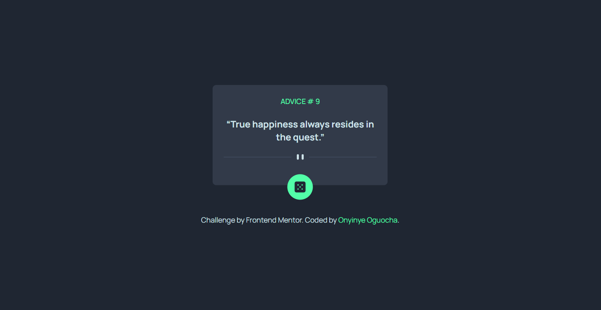
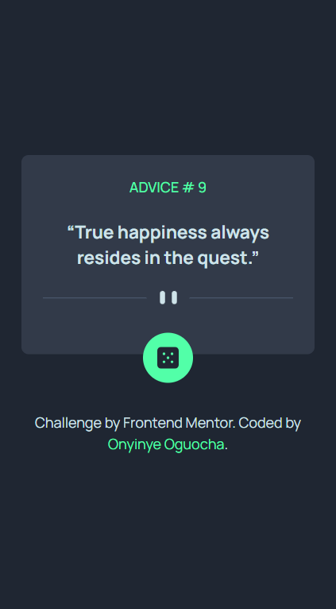

# Frontend Mentor - Advice generator app solution

This is a solution to the [Advice generator app challenge on Frontend Mentor](https://www.frontendmentor.io/challenges/advice-generator-app-QdUG-13db). Frontend Mentor challenges help you improve your coding skills by building realistic projects.

## Table of contents

- [Overview](#overview)
  - [The challenge](#the-challenge)
  - [Screenshot](#screenshot)
  - [Links](#links)
- [My process](#my-process)
  - [Built with](#built-with)
  - [What I learned](#what-i-learned)
  - [Continued development](#continued-development)
  - [Useful resources](#useful-resources)
- [Author](#author)
- [Acknowledgments](#acknowledgments)

## Overview

### The challenge

Users should be able to:

- View the optimal layout for the app depending on their device's screen size
- See hover states for all interactive elements on the page
- Generate a new piece of advice by clicking the dice icon

### Screenshot




### Links

- Solution URL: [Github Repo](https://github.com/stephany247/advice-generator-app)
- Live Site URL: [Add live site URL here](https://advice-generator-app-v75e.vercel.app/)

## My process

### Built with

- Semantic HTML5 markup
- CSS custom properties
- Flexbox
- CSS Grid
- Mobile-first workflow
- [React](https://reactjs.org/) - JS library
- [Tailwind CSS](https://tailwindcss.com/) - Tailwind library

### What I learned

While working on this project, I deepened my understanding of handling API requests in React and managing state efficiently with useState. I also reinforced my knowledge of conditional fetching and handling errors gracefully.

One key takeaway was the importance of properly initializing state to avoid unexpected UI behavior. Initially, my app displayed advice with an ID of 117 even when it should have shown my predefined state. I learned that fetching advice on mount without checking initial conditions led to overwriting my default state.

```js
const fetchAdvice = async () => {
  try {
    const response = await fetch("https://api.adviceslip.com/advice");
    const data = await response.json();
    setAdvice(data.slip.advice);
  } catch (error) {
    console.error("Error fetching advice:", error);
  }
};
```

This experience reinforced the importance of debugging deployment issues early, such as unused useEffect, which initially caused deployment failure.

### Continued development

Going forward, I want to refine my understanding of API handling in React, particularly optimizing requests to avoid unnecessary fetch calls. I also plan to explore more advanced state management techniques, such as React Query, to handle API data efficiently.

Additionally, I aim to improve my use of Tailwind CSS for custom styling. While I successfully implemented a glowing drop-shadow effect, I’d like to deepen my knowledge of utility classes and how to extend Tailwind for even more precise styling.

### Useful resources

- [W3Schools TypeScript Tutorial](https://www.w3schools.com/typescript/index.php) - Helped me understand TypeScript basics and how to apply them in my project.
- [MDN Web Docs](https://developer.mozilla.org/en-US/) - A great reference for understanding HTML, CSS, and JavaScript concepts, which helped clarify some accessibility best practices.
- [Tailwind CSS Documentation](https://tailwindcss.com/docs) - Provided guidance on utility classes and responsive design techniques, making styling much more efficient.

## Author

- Website - [Onyinye Stephanie Oguocha](https://www.your-site.com)
- Frontend Mentor - [stephany247](https://www.frontendmentor.io/profile/stephany247)
- Twitter - [@stephanyoguocha](https://x.com/stephanyoguocha)

## Acknowledgments

I would like to thank the following resources and individuals for their support and inspiration:

- [Frontend Mentor](https://www.frontendmentor.io) - For providing the project challenge.
- [React](https://reactjs.org) - For the amazing library.
- [Tailwind CSS](https://tailwindcss.com) - For the utility-first CSS framework.
